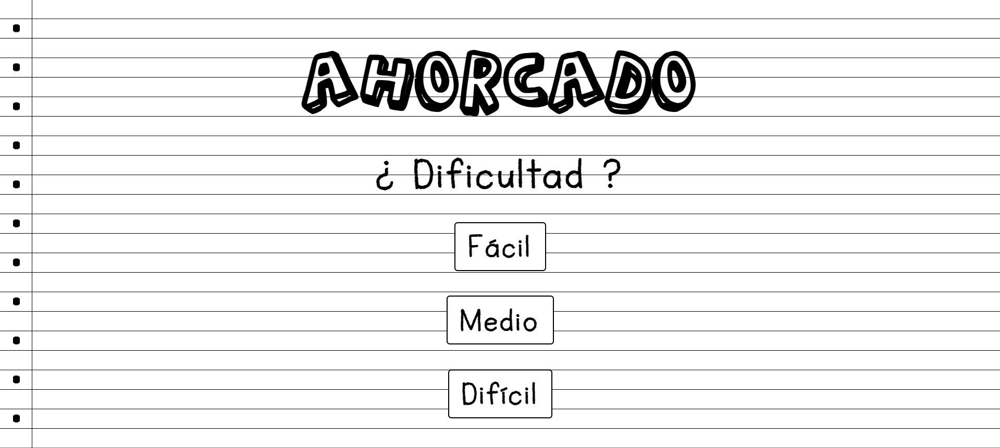
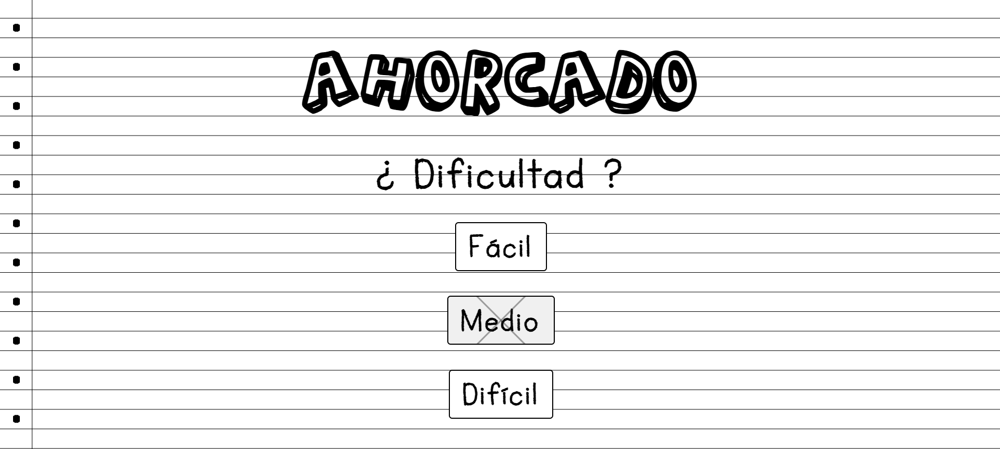
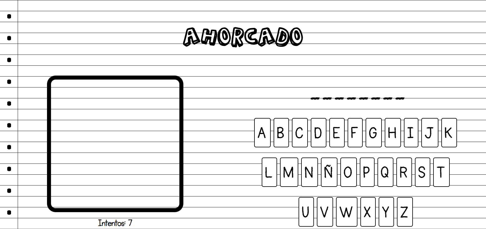
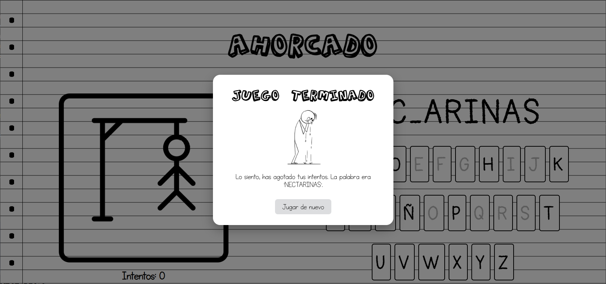
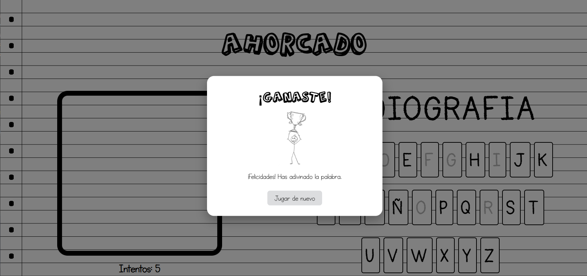

# Hangman Frontend

_A fun, interactive Hangman game built with Astro, React and styled in CSS.

[Live Demo → 🌐](https://hangman-frontend-sable.vercel.app)

---

## Features

- **Multiple difficulty levels** (Easy, Medium, Hard)  
- **Responsive layout**: plays great on desktop, tablet and mobile  
- **Animated Hangman drawing** as you make incorrect guesses  
- **Clean, modern UI** with custom fonts and CSS modules  
- **Win/Lose modal** with play‑again option  

---

## 🛠️ Tech Stack

- **Framework:** [Astro](https://astro.build)  
- **UI Libraries:** React.  
- **Styling:** Plain CSS (modular styles in `src/styles`)  
- **Build & Deploy:** Vite-powered Astro, deployed on Vercel  

---

## 🚀 Deployed in Vercel 

1. **Clone the repo**  
   ```bash
   git clone https://github.com/srcArq/hangman-frontend.git
   cd hangman-frontend
   
## 🕹️ Game

<p align="center">
  
  
  
</p>

<p align="center">
  
  
</p>

