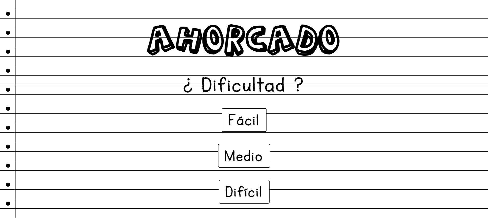
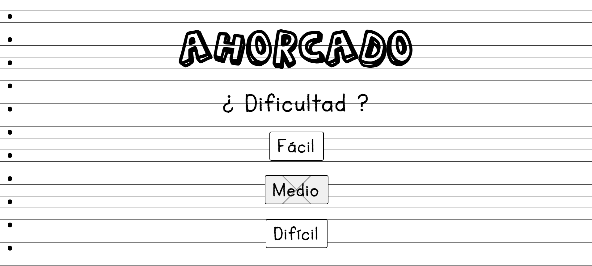
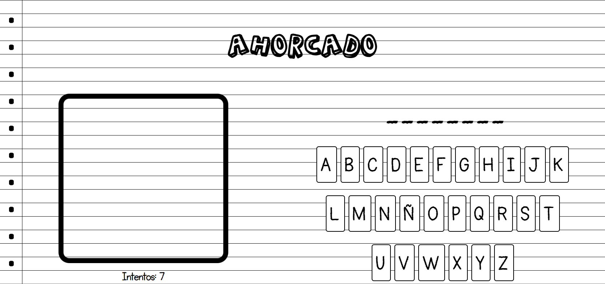
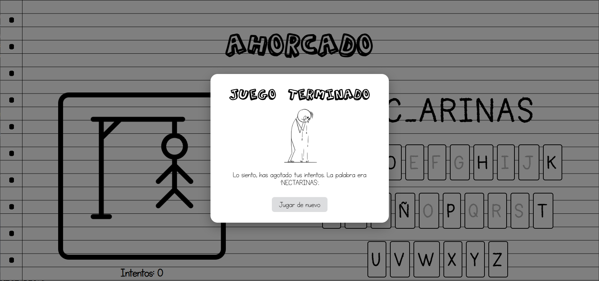
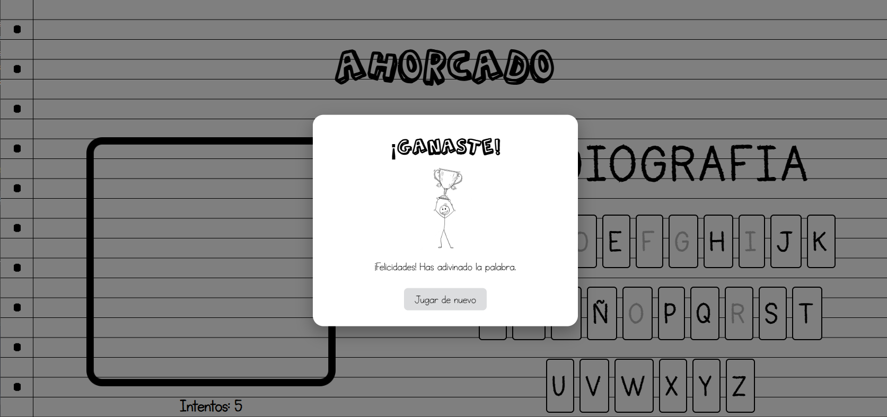

# Hangman Frontend

_A fun, interactive Hangman game built with Astro, React and styled in CSS.

[Live Demo → 🌐](https://hangman-frontend-sable.vercel.app)

---

## Features

- **Multiple difficulty levels** (Easy, Medium, Hard)  
- **Responsive layout**: plays great on desktop, tablet and mobile  
- **Animated Hangman drawing** as you make incorrect guesses  
- **Clean, modern UI** with custom fonts and CSS modules  
- **Win/Lose modal** with play‑again option  

---

## 🛠️ Tech Stack

- **Framework:** [Astro](https://astro.build)  
- **UI Libraries:** React.  
- **Styling:** Plain CSS (modular styles in `src/styles`)  
- **Build & Deploy:** Vite-powered Astro, deployed on Vercel  

---

## 🚀 Getting Started

1. **Clone the repo**

   ```bash
   git clone https://github.com/srcArq/hangman-frontend.git
   cd hangman-frontend
   ```

2. **Install dependencies**

   ```bash
   npm install
   ```

3. **Configure environment variables**

   Copy the example file and set the backend API base URL:

   ```bash
   cp .env.example .env
   ```

   Then edit `.env` and set `PUBLIC_API_URL` to your backend base URL
   (e.g. `http://localhost:8080` in local development):

   ```bash
   PUBLIC_API_URL=http://localhost:8080
   ```

   > **Note:** `PUBLIC_API_URL` is a **public, client-side** variable
   > (the `PUBLIC_` prefix exposes it to the browser via
   > `import.meta.env.PUBLIC_API_URL`). Do **not** store secrets in it.

4. **Run the development server**

   ```bash
   npm run dev
   ```

   The app will be available at the URL printed in the console
   (by default `http://localhost:4321`).

5. **Build for production**

   ```bash
   npm run build
   ```

   Preview the production build locally:

   ```bash
   npm run preview
   ```

6. **Run the tests**

   ```bash
   npm run test
   ```

---

## ☁️ Deploy on Vercel

This project is deployed on Vercel. Remember to define the `PUBLIC_API_URL`
environment variable in the Vercel project settings so the frontend can reach
the backend.

---

## 🕹️ Game

<p align="center">
  
  
  
</p>

<p align="center">
  
  
</p>

